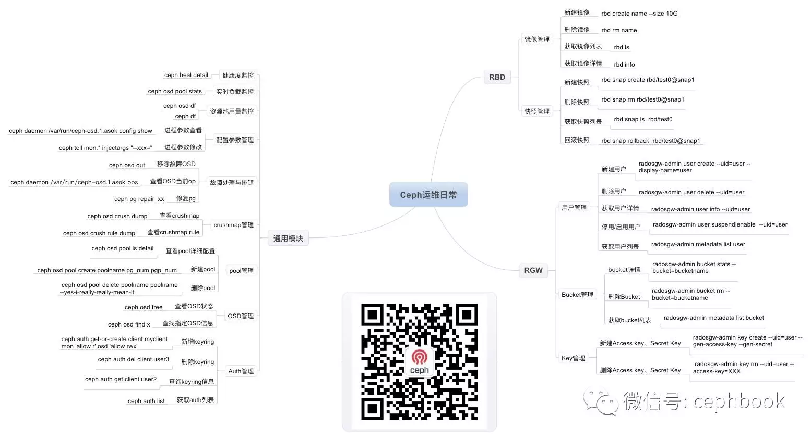

# trash: 主要是各种常用脚本

ceph基本命令

本文主要是各种脚本的集合，暂时包括shell、python和容器相关脚本

## navigation 导航页

1. [navigation](01-navigation.md)

## shell脚本列表

1. [mysql备份脚本](01-mysql备份.md)
1. [test](02-批量启动docker)

## python脚本列表

1. [缩容ceph的osd脚本](01-缩容ceph.md)
1. [小米的ceph监控客户端脚本](02-falcon_ceph_mon.md)
1. [邮件发送脚本](03-sendmail.md)
1. [租户报警脚本](04-tenant_alarm.md)

## 容器脚本列表

1. [批量启动容器](01-批量启动docker.md)
1. [deployment_nginx](02-deployment_nginx.md)
1. [Node_Exporter](03-node_exporter.md)
1. [Job_CronJob](04-Job_CronJob.md)

## sql查询列表

1. [租户和虚机查询](01-ten_vm.md)
1. [租户到期提醒查询](02-ten_alarm.md)
